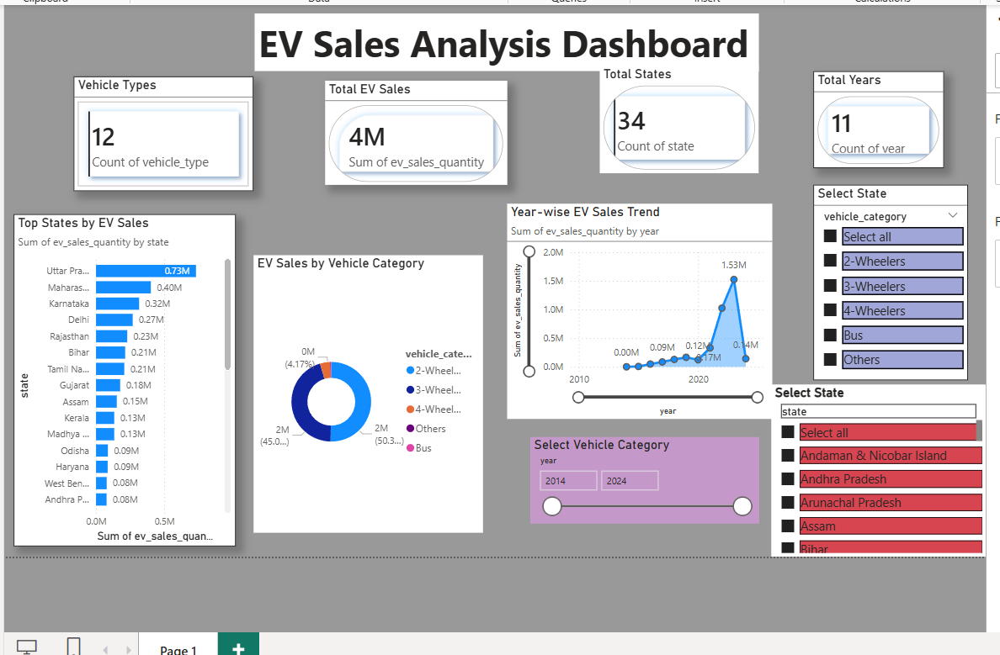

# EV Sales Analysis – India 

## About the Project
This project focuses on analyzing Electric Vehicle (EV) sales data in India to understand how EV adoption has grown over the years.  
The analysis highlights trends across years, states, and vehicle categories using Python, SQL, Power BI, and Streamlit dashboards.

The goal of this project is to convert raw EV sales data into meaningful insights through analysis and visualization.

## Tools & Technologies
- Python (Pandas, NumPy)
- SQL
- Power BI
- Streamlit
- Matplotlib, Seaborn

## Data Description
The dataset contains EV sales information across different states and years in India.

Key columns include:
- State
- Year
- Vehicle Category
- EV Sales Count

The cleaned and summarized datasets are available in the `data` folder.

## Project Structure
- `data/` – Raw, cleaned, and aggregated EV sales datasets  
- `notebooks/` – Python notebooks for data analysis  
- `sql/` – SQL queries used for analysis  
- `powerbi/` – Power BI dashboard file  
- `Screenshots/` – Dashboard screenshots  
- `app.py` – Streamlit application  

## Key Analysis Performed
- Year-wise EV sales trend analysis
- State-wise EV sales comparison
- Vehicle category-wise sales distribution
- Growth pattern identification

## Dashboards & Visual Outputs

### Power BI Dashboard

### Streamlit Dashboard – EV Sales Overview
.png)

### Streamlit Dashboard – Analysis
.png)

.png)

.png)

## Key Insights
- EV sales in India have increased significantly in recent years.
- Two-wheelers account for the largest share of EV sales.
- EV adoption varies across states, influenced by infrastructure and policies.
- Overall trend indicates steady growth in the EV market.

## Why This Project is Important
This project demonstrates how data analysis and dashboards can be used to understand real-world trends in electric mobility.  
It reflects practical skills in data cleaning, analysis, SQL querying, and visualization using Power BI and Streamlit.

## How to Run the Project
1. Clone the repository
2. Install dependencies using:
   pip install -r requirements.txt
3. Run the Streamlit app:
   streamlit run app.py
